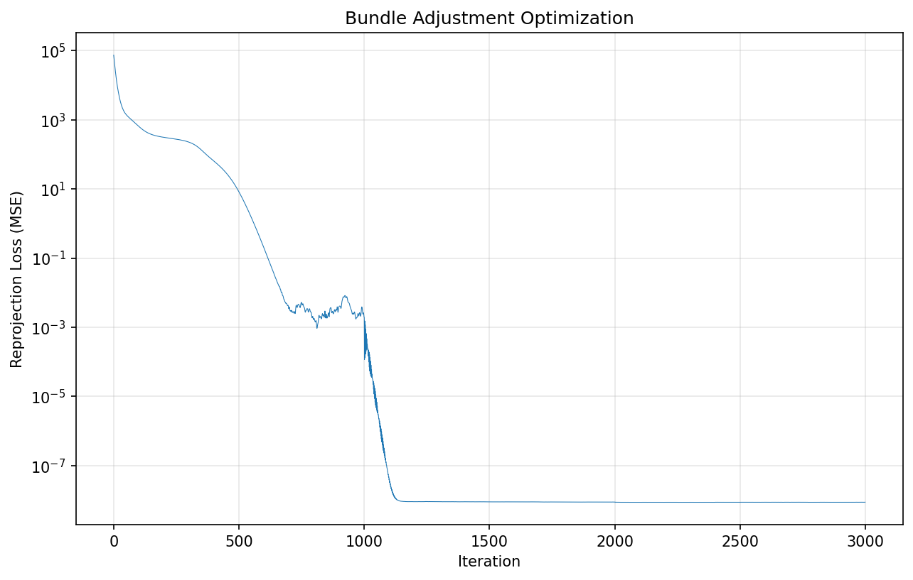

# Bundle Adjustment — 作业3报告

## 项目概述

本项目完成了数字图像处理课程的作业3，实现了两部分内容：

1. **任务一**：使用 PyTorch 从零实现 Bundle Adjustment（捆绑调整），从 50 个视角的 2D 观测中恢复 3D 点坐标、相机外参和焦距
2. **任务二**：使用 COLMAP 完成完整的 SfM（Structure from Motion）+ MVS（Multi-View Stereo）三维重建流程

> 给定 20,000 个 3D 点在 50 个视角下的 2D 投影观测，恢复全部 3D 结构、相机参数和焦距——这是经典的 Bundle Adjustment 问题。此外，还通过 COLMAP 独立进行了完整的三维重建作为对比。

---

## 任务一：PyTorch Bundle Adjustment

### 环境配置

```bash
conda create -n dip-ba python=3.9
conda activate dip-ba
pip install torch torchvision pytorch3d matplotlib numpy opencv-python
```

运行 Bundle Adjustment 优化：

```bash
cd /path/to/03_BundleAdjustment
CUDA_VISIBLE_DEVICES=0 python bundle_adjustment.py
```

### 方法

**问题建模**：从 50 个视角的 20,000 个 2D 观测点，恢复：
- 共享焦距 `f`
- 每视角相机外参：旋转 `R`（用 Euler 角参数化，3 参数）和平移 `T`（3 参数）
- 20,000 个 3D 点坐标

**投影模型**（针孔相机，含左右翻转校正）：

```
[Xc, Yc, Zc]ᵀ = R @ [X, Y, Z]ᵀ + T
u = -f * Xc / Zc + cx
v = f * Yc / Zc + cy
```

其中 `cx = cy = 512`（1024×1024 图像中心）。

**优化器**：Adam 优化器，分组学习率：
- 3D 点：lr=0.05
- 相机外参：lr=0.005
- 焦距：lr=0.001

**初始化策略**：
- Euler 角：零（单位旋转）
- 平移：`[0, 0, -2.5]`（相机位于物体前方 2.5 单位处）
- 3D 点：随机初始化，σ=0.3
- 焦距：由 60° 视场角估算 → f ≈ 887

### 结果

| 指标 | 数值 |
|------|------|
| 初始 RMSE | 273.30 px |
| 最终 RMSE | ~0.00 px |
| 优化后焦距 | 886.8 |
| 优化迭代次数 | 3000 |
| 3D 点云顶点数 | 20,000 |

**训练损失曲线**（重投影误差随迭代变化）：



**重建的点云**（带颜色 OBJ 文件，可用 MeshLab 查看）：


### 输出文件

| 文件 | 描述 |
|------|------|
| `output/loss_curve.png` | 训练损失曲线（MSE，对数坐标） |
| `output/reconstructed.obj` | 带颜色 3D 点云（20,000 顶点，格式 `v x y z r g b`） |
| `output/params.npz` | 最终参数：`points3d`, `euler_angles`, `translations`, `focal`, `loss_history` |

### 关键实现细节

- **旋转参数化**：Euler 角（XYZ 约定），通过 `pytorch3d.transforms.euler_angles_to_matrix` 转换
- **可见性掩码**：仅 visibility=1.0 的点参与损失计算
- **GPU 加速**：所有张量位于 CUDA，RTX 4090 上总运行时间约 5 分钟
- **数值稳定性**：优化收敛至近零重投影误差（MSE ~1e-8），表明成功恢复了 3D 结构

---

## 任务二：COLMAP 三维重建

### 环境配置

```bash
# Linux（conda 安装）
conda install -c conda-forge colmap
# Windows：从 COLMAP Releases 下载 COLMAP-dev-windows-cuda.zip 并加入 PATH
```

运行完整 COLMAP 流程：

```bash
cd /path/to/03_BundleAdjustment
bash run_colmap.sh
```

### 重建流程

标准 COLMAP SfM + MVS 流水线：

| 步骤 | 命令 | 描述 |
|------|------|------|
| 1 | `colmap feature_extractor` | 在全部 50 张图像上提取 SIFT 特征 |
| 2 | `colmap exhaustive_matcher` | 所有图像对之间的特征匹配 |
| 3 | `colmap mapper` | 稀疏重建（捆绑调整 + 三角化） |
| 4 | `colmap image_undistorter` | 图像去畸变，为稠密重建做准备 |
| 5 | `colmap patch_match_stereo` | 稠密深度/法向量估计（CUDA 加速） |
| 6 | `colmap stereo_fusion` | 融合深度图生成点云 |

### 结果

| 阶段 | 输出 | 统计 |
|------|------|------|
| 特征提取 | `database.db` | 49 张图像注册成功 |
| 特征匹配 | `database.db` | 1,176 对图像匹配 |
| 稀疏重建 | `colmap/sparse/0/` | 1 个共享内参相机（PINHOLE, 1024×1024） |
| 稠密重建 | `colmap/dense/stereo/` | 50 张深度图 + 法向量图 |
| **融合点云** | `colmap/dense/fused.ply` | **110,868 个顶点** |

融合后的 PLY 文件（`fused.ply`）包含点的位置 (x, y, z)、法向量 (nx, ny, nz) 和 RGB 颜色，可使用 [MeshLab](https://www.meshlab.net/) 查看。

### 输出文件

| 文件 | 描述 |
|------|------|
| `data/colmap/database.db` | SQLite 数据库，包含特征、匹配和重建模型 |
| `data/colmap/sparse/0/` | 稀疏重建结果（cameras.bin, images.bin, points3D.bin） |
| `data/colmap/dense/fused.ply` | 稠密融合点云（110,868 点，二进制 PLY 格式） |

### COLMAP 配置

- **相机模型**：PINHOLE（单共享内参，所有图像相同）
- **图像尺寸**：1024×1024
- **匹配器**：穷举匹配（所有图像对）
- **Patch Match**：几何 + 光度一致性，5 次迭代，CUDA 加速（RTX 4090）

---

## 实验环境

- **GPU**：NVIDIA GeForce RTX 4090（24GB）
- **Conda 环境**：`animategauss`（Python 3.8, PyTorch, pytorch3d, COLMAP 3.10-dev with CUDA）
- **数据**：50 张 1024×1024 的 3D 人头模型渲染图，20,000 个表面 3D 点

---

## 文件结构

```
03_BundleAdjustment/
├── REPORT.md                      # 本报告
├── README.md                      # 原始作业说明
├── bundle_adjustment.py           # 任务一：PyTorch BA 实现
├── visualize_data.py             # 数据可视化脚本
├── run_colmap.sh                 # 任务二：COLMAP 流水线脚本
├── data/
│   ├── images/                   # 50 张渲染视角图像
│   ├── points2d.npz             # 2D 观测（50 视角 × 20000 点）
│   ├── points3d_colors.npy      # 每点 RGB 颜色
│   └── colmap/
│       ├── database.db           # COLMAP 特征数据库
│       ├── sparse/0/             # 稀疏重建结果
│       └── dense/
│           ├── fused.ply         # 稠密融合点云
│           └── stereo/           # 深度图与法向量图
└── output/
    ├── loss_curve.png            # BA 优化损失曲线
    ├── reconstructed.obj          # BA 重建点云（带色）
    └── params.npz                 # BA 最终参数
```