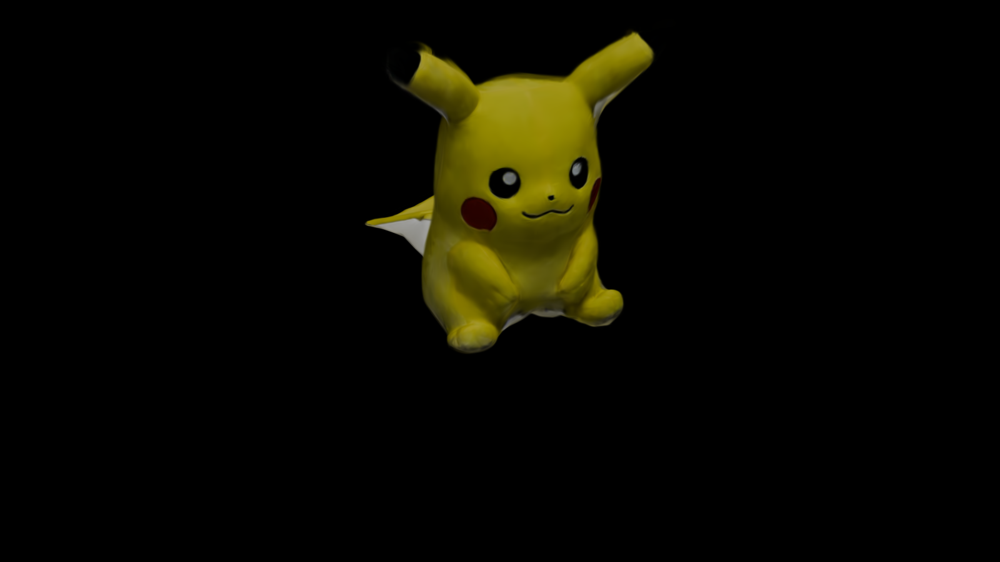

# Object Gaussian Splatting
我们希望能够生成高质量的物体GS点云，然而直接拍摄照片训练高斯往往会遇到很多问题，比如相机标定不准确甚至无法标定。为了克服这一问题，我们利用现有比较成熟的mesh重建。

## 重建步骤:
- 使用polycam软件扫描得到高质量mesh,以obj文件存储
- 利用blender围绕物体生成相机，并渲染得到多视角图片
- 生成colmap数据集以进行高斯点云的初始化

`python path\to\blender2colmap.py -- output_path  obj_path`

## 重建结果：
